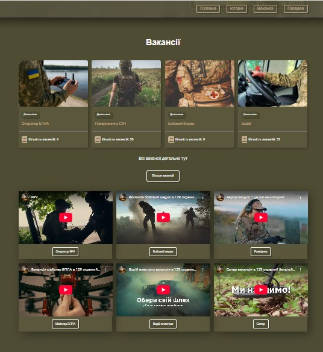
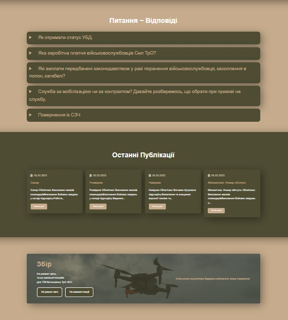
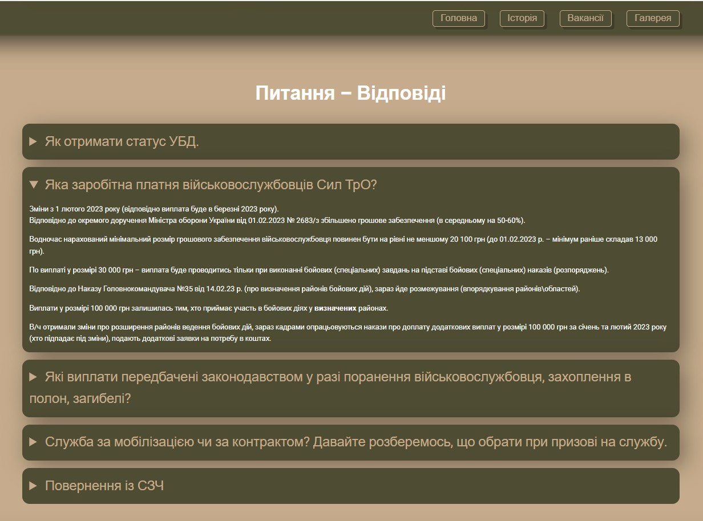
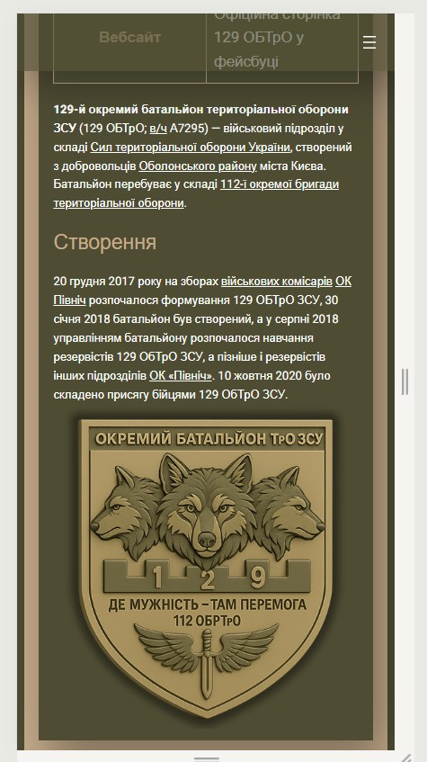
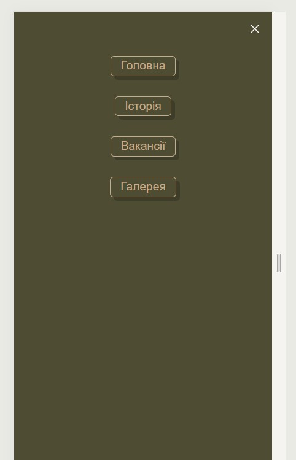
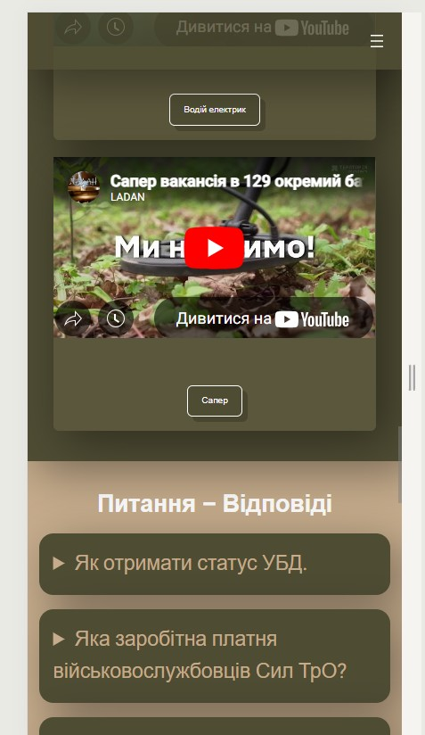
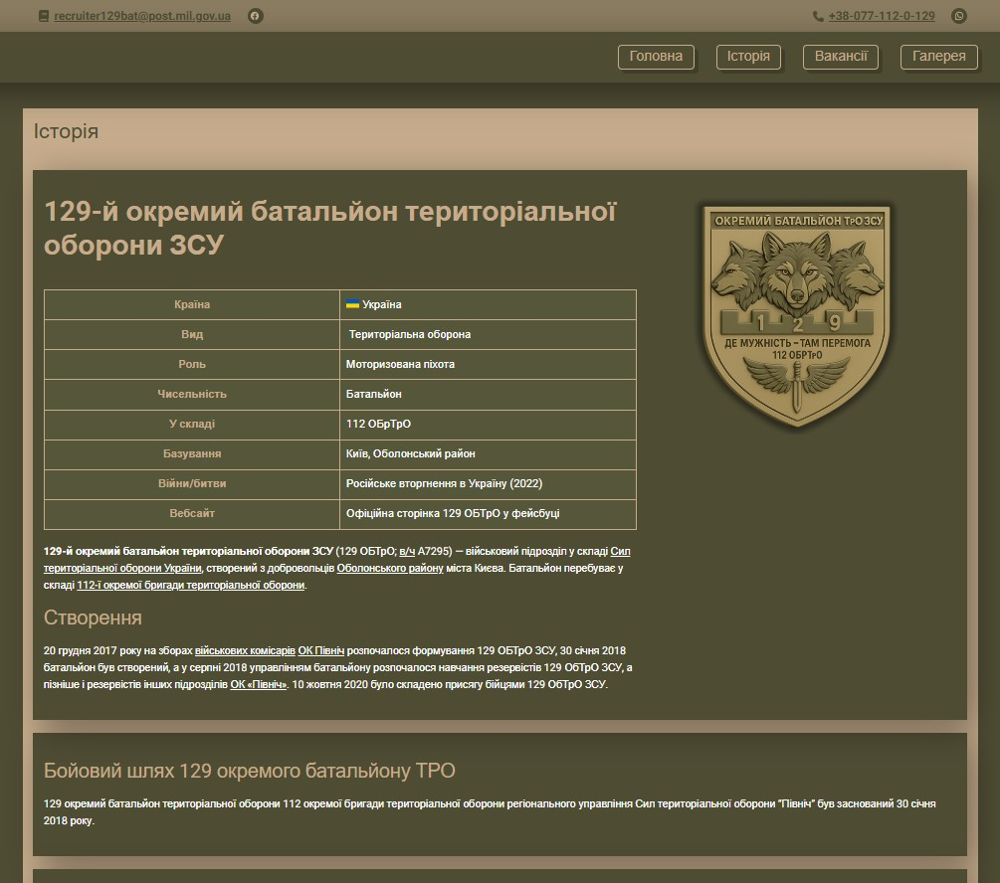
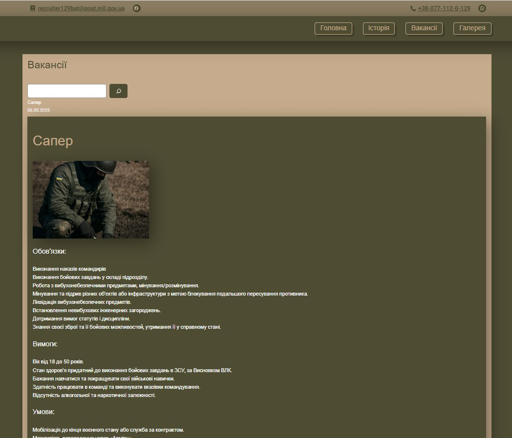
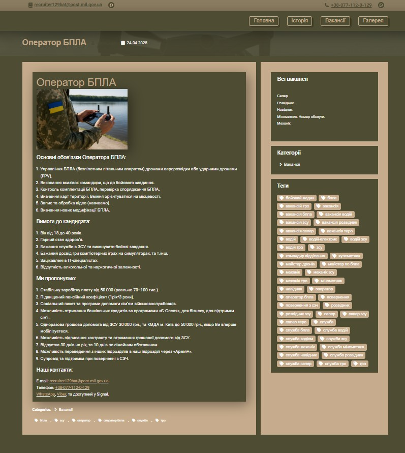

# wordpress-portfolio-site

# 129 батальйон ТРО – офіційний сайт

🌐 **Live Website:** [https://129bat-tro.org.ua](https://129bat-tro.org.ua)

Це офіційний сайт 129 окремого батальйону територіальної оборони, створений на базі шаблону WordPress.

---

## 📄 Про проєкт

Сайт інформує відвідувачів про діяльність батальйону, його історію, контактну інформацію, вакансії, питання та відповіді, волонтерські ініціативи та інші важливі розділи.

Шаблон:

🔹 Адаптований під мобільні пристрої  
🔹 Реалізовано багатосторінкову структуру  
🔹 Вбудовані форми зворотного зв’язку

Кожна секція та сторінка чітко виконує функції які були вказані замовником.

Куплений домен та хостинг, встановлений шаблон та інші початкові речі для запуску проекту.

Використаний шаблон EduGrove:
- змінена кольорова гама;
- встановлене відео в hero;
- змінені секції під потреби замовника;
- доданий плагін для розділу фото на папки;
- вставлено пару кастомних стилів такі як обводка для h1 та інші;
- встановлені HTML якоря на секції та на дописи з вакансіями;
- оптимізація під різні екрани та інше.

---

## 🧰 Використані мною технології

- WordPress CMS
- HTML5 / CSS3
- Шаблон WordPress (кастомізований)

---

## 🖼️ Скріншоти

### 🏠 Головна сторінка

.jpg)  
  
  

### 📱 Мобільна версія

  
  

### 📘 Сторінка історії

### 📋 Сторінка вакансій

### 📝 Окремий допис

---

> Щоб побачити більше — відвідайте [сайт](https://129bat-tro.org.ua)

---

## 📬 Зв’язок

Якщо маєш запитання або пропозиції — мої месенджери знаходяться по номеру +380933095903.
